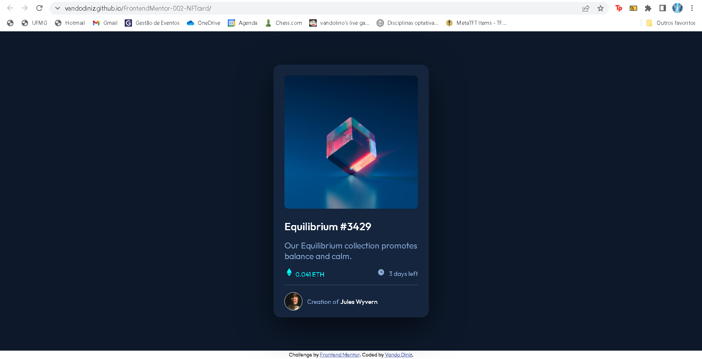
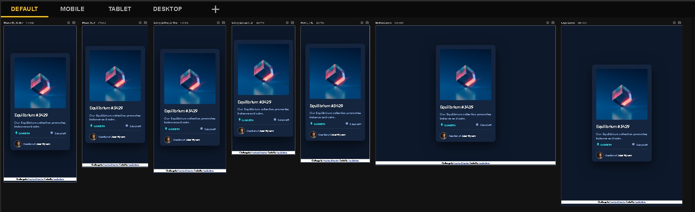

# Frontend Mentor - NFT preview card component

Essa é a solução do desafio [NFT preview card component challenge on Frontend Mentor](https://www.frontendmentor.io/challenges/nft-preview-card-component-SbdUL_w0U/hub/nft-preview-card-component-Hk65dYqfq) do site FrontEnd Mentor! 

## Sumário

- [Visão Geral](#visão-geral)
  - [Screenshots](#screenshots)
  - [Links](#links)
  - [Autor](#autor)
- [Desenvolvimento](#desenvolvimento)
  - [Ferramentas Utilizadas](#ferramentas-utilizadas)
  - [Referêcias](#referências)

## Visão Geral

### Screenshots

### Links

- URL da Solução: [https://www.frontendmentor.io/solutions/nft-preview-card-component-solution-BJsCyI6zc](https://www.frontendmentor.io/solutions/nft-preview-card-component-solution-BJsCyI6zc)
- URL do Site: [https://github.com/vandodiniz/FrontendMentor-002-NFTcard](https://github.com/vandodiniz/FrontendMentor-002-NFTcard)

### Autor

- Frontend Mentor - [@vandodiniz](https://www.frontendmentor.io/profile/vandodiniz)
- Linkedin - [Vando Diniz](https://www.linkedin.com/in/vando-diniz-79b431234/)

## Desenvolvimento

### Ferramentas Utilizadas

- HTML 5 Semântico
- CSS
- Responsividade

### Referências

- [A Complete Guide to Flexbox](https://css-tricks.com/snippets/css/a-guide-to-flexbox/) - Este site me ajudou a centralizar meu conteúdo de forma mais eficiente usando o modelo Flexbox.
- [mage Hover Text Overlay Effect with HTML & CSS - Web Design Tutorial](https://www.youtube.com/watch?v=exb2ab72Xhs&t=168s&ab_channel=dcode) - Este video me ajudou a ter uma noçao de como aplicar o overlay de imagens com o css.
